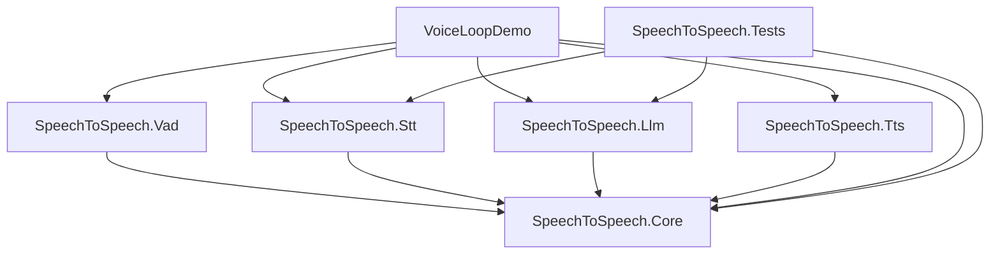
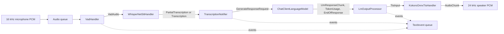
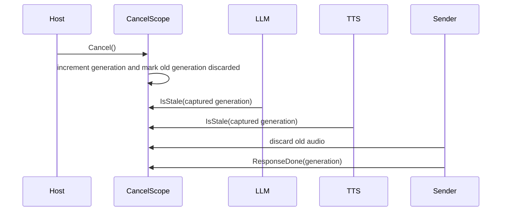

# Architecture

## Project dependency graph

Core has no dependency on a model backend or audio API. Each backend library implements one stage by consuming and producing Core pipeline items. The sample is the composition root.

## End-to-end data flow

Every handler owns a dedicated foreground thread. Adjacent stages communicate through `PipelineQueue<IPipelineItem>`, a synchronized FIFO queue. Processing APIs are synchronous iterators: one input may produce zero, one, or many outputs.

## Data-plane messages

All queue values implement `IPipelineItem`. Typed messages inherit `PipelineMessage` and carry optional `TurnId` and `TurnRevision` fields.

| Type | Producer | Consumer | Purpose |
| --- | --- | --- | --- |
| `AudioChunk` | capture/send layer or TTS | VAD or playback | Little-endian signed 16-bit PCM bytes and optional runtime config |
| `VadAudio` | VAD | STT | 16 kHz float audio, progressive/final mode, and timing |
| `PartialTranscription` | STT | notifier | Interim transcript for client display only |
| `Transcription` | STT | notifier | Final text, language code, and speech-stop timestamp |
| `GenerateResponseRequest` | notifier or host | LLM | Runtime config, response overrides, language, and turn identity |
| `LlmResponseChunk` | LLM | output processor | Text and completed tool calls; cancellation-aware |
| `TokenUsage` | LLM | output processor | Input and output token counts |
| `EndOfResponse` | LLM | output processor and TTS | Completion marker with an optional error |
| `TtsInput` | output processor | TTS | Text, language, response/session config, and cancellation generation |
| `AudioOutput` | remote TTS/host | send layer | PCM output bytes with cancellation generation |

The concrete contracts are defined in [Messages.cs](../src/SpeechToSpeech.Core/Pipeline/Messages.cs).

## Client-facing events

Events travel on a side-channel rather than the audio pipeline. Their JSON names use snake case through `RealtimeJson`.

| Event | Meaning |
| --- | --- |
| `SpeechStartedEvent` | VAD crossed the speech threshold; may indicate a reopened turn |
| `SpeechStoppedEvent` | VAD finalized an utterance |
| `PartialTranscriptionEvent` | Incremental transcript delta |
| `TranscriptionCompletedEvent` | Final transcript and detected language |
| `AssistantTextEvent` | Assistant text and completed tool calls |
| `TokenUsageEvent` | Provider token accounting |
| `ResponseFailedEvent` | Generation failed but the response lifecycle still closed |

See [Events.cs](../src/SpeechToSpeech.Core/Pipeline/Events.cs) for serialized fields.

## Turn revisions

Realtime transcription can emit a final segment and then reopen it when speech resumes quickly. `SpeculativeTurnTracker` prevents outputs from an older transcript revision from leaking into the current response.

1. VAD observes a `(turnId, revision)` pair.
2. A possible continuation creates a pending reopen candidate.
3. STT, LLM, and TTS check that their revision is still latest.
4. Output may wait through a short reopen/grace window.
5. Once committed, a revision cannot move backward.

The tracker is lock-protected, bounded, and prunes old inactive turns. It tracks up to 2048 turns by default.

## Barge-in cancellation

`CancelScope` is a generation counter shared by stages and the host:

Messages implementing `ICancellable` carry the generation captured when the response started. Cancellation does not rely on wall-clock timing, so overlapping handler work cannot revive an old response.

## Session and response configuration

`RuntimeConfig` combines a thread-safe `Chat` and the active `SessionCreateRequest`. A host can merge partial session updates with `ApplySessionUpdate`. Per-response `ResponseCreateParams` can override instructions, tools, output modalities, audio voice, and generation settings.

Response semantics are significant:

- Missing or empty output modalities imply audio is wanted.
- `conversation: "none"` creates an out-of-band response that does not mutate the main conversation.
- A null response input copies the current chat for generation.
- An empty response input starts with no conversation history.
- A non-empty response input creates an isolated chat seeded with those items.

## Lifecycle and shutdown

`PipelineRunner.Start` launches each handler as a long-running task, which gives every stage its own dedicated thread rather than a pool thread — stages whose work is synchronous ONNX inference occupy that thread for the length of a call and would otherwise starve the pool. A normal pipeline shutdown uses a cascading `SentinelMessage.PipelineEnd`: each stage finishes, cleans up, forwards the sentinel, and exits. `PipelineRunner.StopAsync` also cancels handlers and waits up to five seconds per stage.

`PipelineControlMessage.SessionEnd` is different from `PipelineEnd`. It performs a soft per-session reset while retaining handler threads and loaded models for reuse.

For a graceful host:

1. Stop accepting new input.
2. Allow or cancel the active generation.
3. Put `SentinelMessage.PipelineEnd` into the first queue.
4. Drain the terminal queue until the sentinel arrives.
5. Stop/join handler threads.
6. Dispose shared resources and close the chat.

## Concurrency model

| Component | Concurrency contract |
| --- | --- |
| `PipelineQueue<T>` | Multi-producer/multi-consumer monitor lock; synchronous blocking operations |
| `BaseHandler` | One dedicated consumer task per instance |
| `RuntimeConfig` | One writer, many readers; session access is lock-protected |
| `Chat` | Lock-protected buffer; optional single-flight background compaction |
| `CancelScope` | One writer, many readers; generation state is lock-protected |
| `SpeculativeTurnTracker` | Lock-protected turn/revision state with monitor waits |
